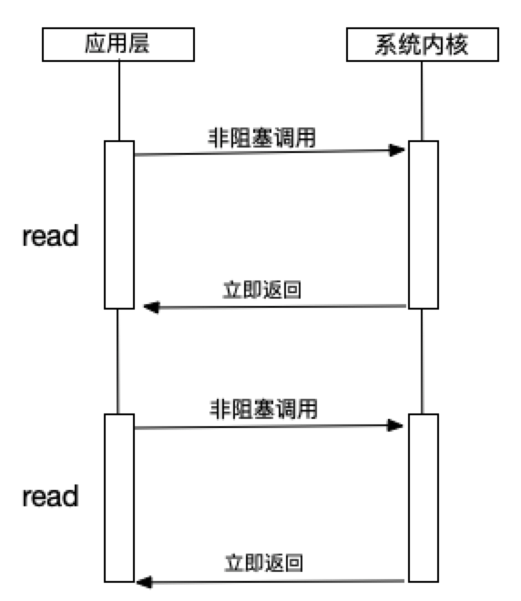
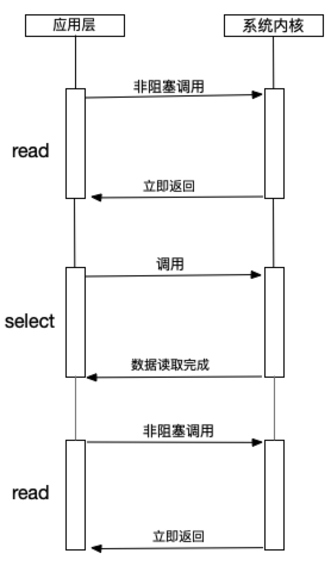
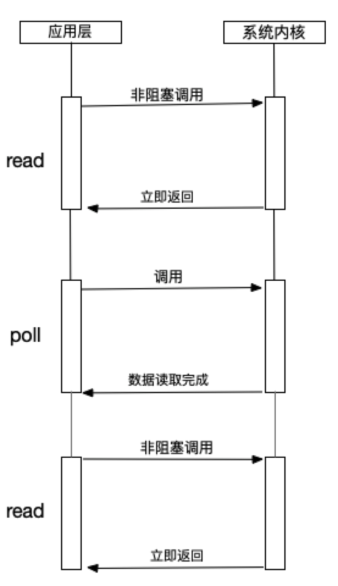
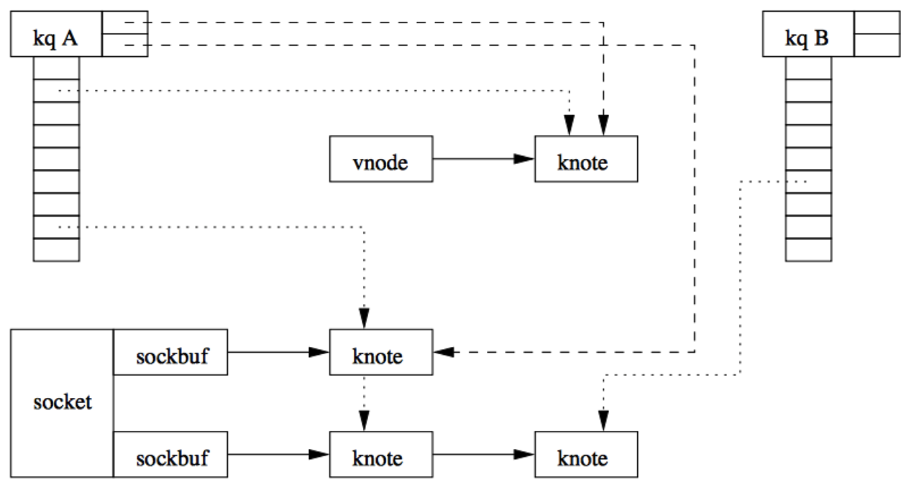
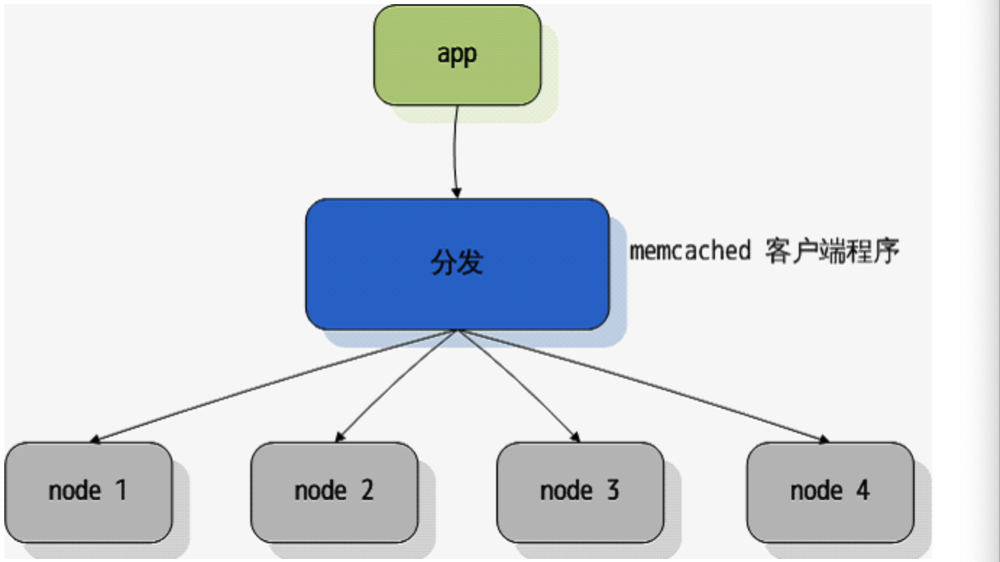

# MemcacheVsRedis
## Memcache是什么？
和Redis类似，可以将数据存储到内存里面，是一种内存Cache。不过memcache不仅仅可以存储普通字符，还可以存储图片和视频等等。
## Memcache和Memcached的区别
- Memcache是一个自由和开放源代码、高性能、分配的内存对象缓存系统。用于减轻数据库负载。
- Memcached是该系统的项目名称，Memcached是该系统的主程序文件。这里的d的英文是daemon(守护进程)，就是常驻进程的意思。
  以守护程序方式运行在一个或多个服务器中，随时接受客户端的连接操作，使用共享内存存取数据。
## Memcached的特点
 - 协议简单:使用简单的基于文本的协议；
 - 基于libevent的事件处理

    1）libevent是一个程序库，他将Linux的epoll、BSD类操作系统的kqueue等时间处理功能封装成统一的接口，memcached使用libevent从而在Linux、BSD、Solaris等操作系统
     发挥高性能；
    2）说到epoll和kqueue，这里和NodeJs联系起来讲一下。提起NodeJs的特点，人们常常说，它是基于事件驱动，异步且非阻塞的。这里的异步非阻塞就和epoll和kqueue有关系；
    3）与异步相对应的是同步，同步会造成阻塞，从而导致CPU得不到高效的使用。内核在进行文件I/O操作时，通过文件描述符进行管理；
    4）内核在进行文件I/O操作时，通过文件描述符进行管理。应用程序如果需要进行I/O调用，必须先打开文件描述符，然后再根据文件描述符去实现文件的读写。
    阻塞I/O完成整个获取数据的过程，而非阻塞I/O不带数据直接返回，要获取数据，需要通过文件描述符进行获取。
    非阻塞I/O返回的调用的状态，不是业务层需要的数据，所以通过轮训来判断是否完成。下面是几种轮训的技术。
    - read

      
      read是性能最低的一种，通过反复调用来检查I/O的状态来完成完整的数据读取。
    - select

      
      select是在read上进行改进的一种方案，通过文件描述符上的事件状态来进行判断的。它是通过一个长度为1024的数组来存储状态，最多同时检查1024个文件描述符。
    - poll

      
      通过链表来解决select数组长度的限制，但是当文件描述符较多的时候，性能还是十分低下。
    - epoll

      
      针对大批量文件描述符，epoll在poll基础上进行了改进。epoll是Linux下效率最高的I/O事件通知机制。在进行轮训的时候如果没有检查到I/O事件，就会进行休眠。直到事件发生将它唤醒。它不浪费CPU，执行效率较高。
    - kqueue
    
    在NodeJs在0.9.0之前的版本中，它的libev模块就是模仿了libevent来实现事件轮询。在之后的版本就移除了libev模块。
 - 内置内存存储方式: Slab Allocation
   
   常规程序使用内存一般有两种，一种是预先分配，另外一种是动态分配。动态分配从效率的角度来讲相对来慢点，
   因为它需要实时的去分配内存使用，虽然浪费了时间，但是这样做的好处是节约了内存空间。memcached采用的
   是预先分配的原则，这样的方式是拿空间换时间来提高速度，这样做会造成内存空间得不到很好的利用。
   但是memcached采用Slab Allocation机制来解决内存碎片的问题。
   Slab是按照预先规定的大小，将分配的内存分割成特定长度的块。然后将相同大小的块放在一起，形成组。
   例如，分配内存为942BT，Slab将这个分配为3个大小为88BT的块，3个大小为112B的块，3个114B的块，
   然后将相同大小的块放在一起。
 - 基于客户端的分布式
 2. Memcached如何实现分布式

## Memcached的访问模型

 1. 应用程序输入需要写缓存的数据，例如Token；
 2. Memcache API输入路由算法模块，路由算法根据Key和Memcache集群服务列表得到一台服务器编号；
 3. 由服务器编号得到Memcache及对应的IP地址和端口号；
 4. API调用通信模块和指定编号的服务器通信，将数据写入该服务器，完成一次分布式缓存的写操作。
## Memcached内存分配策略-slab 
一个内存分配算法要考虑算法的效率，管理内存所占的空间和内存碎片的问题。
slab能较好的规避内存碎片的问题，但也带来了一定的内存浪费，算法的效率还不错。
## 数据类型
  ### Redis支持String、List、Set、Sorted和Hash
  ### Memcache支持String
## 持久化
  ### Redis支持RDB和AOF的持久化
  ### Memcache不支持持久化
## 大小
  ### Redis的K最大存储量为1G
  ### Memcache最大存储量为1M
## memcachehe和Redis过期键的策略
 ### Redis过期键的删除策略
  - 惰性删除
   1. 在哪里实现？db.c/expireIfNeeded
   2. 如何实现的？
    - 执行读写命令的时候，例如GET、SADD或者HGET；
    - 调用expireIfNeeded：
      1) 获取键的过期时间，如果没有过期时间，那么什么都不做，直接退出；
      2) 如果服务器正在载入，也是什么都不做，直接退出；
      3) 如果过期时间比当前时间小，说明没有过期，也是什么都不做，直接退出；
      4) 删除key，接着像AOF文件或者其他附属子节点传播该过期信息，然后发送事件通知；
      5) 最后删除该key.    
  - 定期删除
   1. 在哪里实现？redis.c/activeExpireCycle
   2. 如何实现的？
    - 数据库周期性的操作redis.c/serverCron时，就执行activeExpireCycle函数分多次遍历多个数据库，从而删除过期键.
      - 设置默认每次检查数据库的数量为16，默认每个数据库检查键的数量为20;
      - 如果实际数量比默认值小，那么就以默认值为准;
 ### memcache过期键的删除策略(LRU-Least Recently Used最近最少使用)
   memcached内部不会监视记录是否过期，而是在查看记录的时间戳，检查记录是否过期。当memcached的内存空间不足的时候，
   就从最近未被使用的记录中搜索，并将其空间分配给新的记录。
 ### 如果键已经过期了，Redis和memcache访问键获取的结果有什么不同？
  - memchache. 返回键对应的值然后删除该键和它对应的值。
  - Redis. 返回空然后删除该键和它对应的值
 - 惰性过期算法(lazy expiration)
 - 最近最少使用算法(LRU：Least Recently Used)
## 安装
 ```
   // 安装
   brew install libevent
   brew install memcached
   // 启动
   brew services memcached start
   // 检查是否启动成功
   ps -ef|grep memcached
   // 连接(默认端口 11211)
   telnet localhost 11211 
 ```
## 实操
  - 基本数据类型的操作
  - 启动时，带参数-f和不带参数f，来观察内存浪费问题
  - 启动时，带参数-M和不带M时，从而观察不使用LRU算法和使用LRU算法的删除机制
  - 设置过期键以及获取过期键的值
  - 分布式
## 一些注意事项
  - Memcached单进程最大使用内存为2G；
  - 最大30天的数据过期时间，即使设置为永久过期，也会在这个时间过期；常量REALTIME_MAXDELTA为60 * 60 * 24 * 30控制；
  - 当个Item最大数据是1MB，超过1M数据不予存储，常量POWER_BLOCK 1048576进行控制；
  - 最大同时连接数是200，通过conn_init()中的freetotal进行控制，最大软连接是1024；
## Memcache适用场景
  - 访问比较频繁的数据，例如Token和首页动态；
  - 访问频繁的查询条件和结果，例如查询大V的粉丝数；
  - 作为Session的存储方式(提升Session的存取性能)；
  - 页面缓存;
  - 更新频繁的非重要的数据;(例如网站的访问量,文章的点击次数)
  - 大量的热数据;(例如直播网站在线人数)
## 资料
  [Memcache官网](https://memcached.org/)
- [参考一](https://www.cnblogs.com/JavaBlackHole/p/7726195.html)
- [node-memcached](https://github.com/elbart/node-memcache#readme)
- [memcached](https://github.com/memcached/memcached)
- [参考二](https://www.jianshu.com/p/b6a710a01a6a)